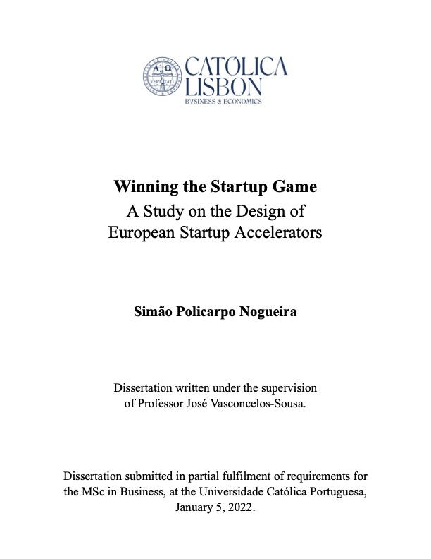

# Winning the Startup Game: A Study on the Design of European Startup Accelerators

by Simão Policarpo Nogueira

This website is an online version of the Dissertation submitted in partial fulfillment of requirements for the MSc in Business at the Universidade Católica Portuguesa, written under the supervision of Professor José Vasconcelos-Sousa.

&nbsp;

<kbd></kbd>

&nbsp;

## Abstract

The European startup and investment scene is quickly expanding: record levels of growth were identified in 2021, revealing this region lacks only in maturity of the ecosystem. Startup accelerators - the new generation of incubators - have picked up on this expansion and turned acceleration into a successful venture. As researchers continue to disagree on the conceptual and typological definitions of startup accelerators, their impact and ideal structure remain unclear. This dissertation aims to transpose a study conducted in the USA startup ecosystem to the European reality through intensive use of data and statistics. It looks into the relationships between the design variables of acceleration programs and the success - or lack thereof - of their graduated startups. Data was collected through a range of aggregators, news articles and websites and put through linear regression models in order to test the hypothesis that an accelerator’s structure impacts its startup’s chances of success. Our results reflect the positive effects of a large and diversified network of partners, sponsors, founders, and companies but struggled to explain the mechanisms behind startup success in full. Our data allowed us to distinguish between ill- and well-designed accelerators, establishing that the impact of the latter is stronger in both the short- and long-term, ultimately proposing the structure for an accelerator that maximises a startup’s chances of success.

## Software implementation

This dissertation makes use of R and the R Markdown language. The entry point to the project is the file `index.Rmd` in the root of the repository. From there, all of the components of the statistical analysis, data, functions and content chapters are loaded.

The data used in this study has been anonymized and is made available upon request. There are two folders containing data: `data-original`, non-anonymized and whose access is restricted to the authors of the dissertation; and `data-anonymized`, for which you can request access. Access to the repository `winning-data-anonymized` (here used as the submodule `data-anonymized`) is required in order to replicate results.

## Access to data

Please reach the author at `s-splnogueira@ucp.pt` in order to request access to the data used in this study. You may be asked to provide details of the intended usage.

## Downloading the code

This project can be downloaded by cloning this git repository:

    git clone git@github.com:simaonogueira101/winning-dissertation.git

or by [downloading the zip file.](https://github.com/simaonogueira101/winning-dissertation/archive/refs/heads/master.zip)

&nbsp;

After cloning the repository, if you already have access to the data submodule(s), run the following command:
    
    git submodule init
    
&nbsp;
    
If you have access to the `data-anonymized` submodule, run:

    git submodule update -f --remote data-anonymized
    
If you have access to the `data-original` submodule, run:

    git submodule update -f --remote data-original
    

## Dependencies

In order to run this code, you will require a local installation of [R](https://www.r-project.org). It is recommended that you use [RStudio](https://www.rstudio.com).

Several packages were used to develop this project. In order to install all requirements, navigate to `helpers/packages.R` and uncomment all code and run the script. Afterwards, you may re-comment these lines to avoid re-installing the packages in the future.

Two external APIs were used. [Google Cloud Platform](https://cloud.google.com) and [Crunchbase](https://www.crunchbase.com). If your goal is to simply replicate results, the only requirement is an API key from GCP with access to their `Geocoding API` and `Maps Static API`. The code expects an `ENV_KEYS.R` file with this key located in the `helpers` folder. An example file `EXAMPLE_ENV_KEYS.R` with the variable naming is available.

## Reproducing the results

Reproduction of results can be achieved by opening the `winning-dissertation.Rproj` file and *knitting* the `index.Rmd` file in RStudio. Should this command be successful, the outputs will be available in the `docs` folder. The project outputs both PDF and HTML versions out of the box.

The format of data is R's `.rds`. You should be able to convert it to other formats (Excel, CSV, etc.) with simple scripts for analysis in other software.

## Author contacts

For any questions, please reach the author at `s-splnogueira@ucp.pt`.

## License

MIT License

Copyright (c) 2022 Simão Policarpo Nogueira

Permission is hereby granted, free of charge, to any person obtaining a copy
of this software and associated documentation files (the "Software"), to deal
in the Software without restriction, including without limitation the rights
to use, copy, modify, merge, publish, distribute, sublicense, and/or sell
copies of the Software, and to permit persons to whom the Software is
furnished to do so, subject to the following conditions:

The above copyright notice and this permission notice shall be included in all
copies or substantial portions of the Software.

THE SOFTWARE IS PROVIDED "AS IS", WITHOUT WARRANTY OF ANY KIND, EXPRESS OR
IMPLIED, INCLUDING BUT NOT LIMITED TO THE WARRANTIES OF MERCHANTABILITY,
FITNESS FOR A PARTICULAR PURPOSE AND NONINFRINGEMENT. IN NO EVENT SHALL THE
AUTHORS OR COPYRIGHT HOLDERS BE LIABLE FOR ANY CLAIM, DAMAGES OR OTHER
LIABILITY, WHETHER IN AN ACTION OF CONTRACT, TORT OR OTHERWISE, ARISING FROM,
OUT OF OR IN CONNECTION WITH THE SOFTWARE OR THE USE OR OTHER DEALINGS IN THE
SOFTWARE.
